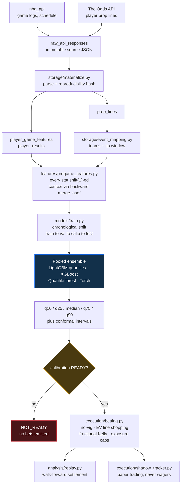

# NBA Props Research Toolkit

> Probabilistic forecasting for NBA player props — from raw data collection through
> calibrated predictions, walk-forward backtesting, and execution risk controls.

[](https://github.com/johnshun001/nba-props/actions/workflows/tests.yml)


A research pipeline that predicts full outcome **distributions** for NBA points,
rebounds, and assists — not just point estimates — then compares them against
sportsbook lines under strict leakage and risk controls.

The design goal is honesty over optimism: every stage refuses to produce output
it cannot support, and reports `NOT_READY` instead of guessing.

> [!IMPORTANT]
> **This does not currently produce bets.** The models train and predict correctly,
> but probability calibration has not been fit yet, so every downstream gate is
> closed by design. See [Project status](#project-status) for exactly why.
> This is research software, not financial advice.

## Quick start

```bash
git clone https://github.com/johnshun001/nba-props.git
cd nba-props
python3.11 -m venv .venv && source .venv/bin/activate
python -m pip install -r requirements-dev.txt
python setup_env.py
python -m pytest -q          # expect: 237 passed
```

That gets you a verified install and an empty local database. To collect data and
train, continue to [02_Run](02_Run/).

## How it works



**Three ideas carry the design:**

| Idea | Where | What it means |
|---|---|---|
| **No leakage** | [`features/pregame_features.py`](features/pregame_features.py) | Every rolling stat is `shift(1)`-ed *before* its window. Context joins use a backward `merge_asof` on `prediction_time`, so a lineup update published after the forecast cannot reach back. Same-game actual minutes are never an input. |
| **Ordered splits** | [`models/ensemble.py`](models/ensemble.py) | Train, validation, calibration, and test are disjoint and strictly chronological — never a random shuffle. Test data is untouched until final scoring. |
| **Fail closed** | [`execution/`](execution/) | Insufficient evidence produces `NOT_READY`, never a default guess. Promotion requires passing both a CLV gate and a calibration gate. |

## Results

Pooled ensemble on a held-out, strictly-later test period (`2025-02-24` to `2025-04-13`).
Reproduce with `python -m models.train`.

| Stat | Test MAE | Test RMSE | Validation MAE |
|---|---|---|---|
| Points | **7.28** | 9.11 | 7.35 |
| Rebounds | **2.15** | 2.71 | 1.99 |
| Assists | **1.82** | 2.42 | 2.03 |

Test and validation scores track closely, which is the signal you want — no large
gap means no meaningful overfit to the validation period.

Probability calibration is **not fit** on the current dataset, so reported
over/under probabilities are uncalibrated and no betting metrics (ROI, CLV,
win rate) exist yet.

## Project status

Last verified 2026-09-08 against 10 tracked players, 2,186 player-game rows,
and 5,919 sportsbook lines.

### Working

| Component | Evidence |
|---|---|
| Ingestion to materialization | 2,186 feature rows, 1,093 results, 5,919 lines parsed with deterministic hashes |
| Event mapping | Matches on normalized teams plus a two-hour tip window; rejects ambiguous matches |
| Leakage-free features | 44/44 feature columns build; `shift(1)` verified on every rolling stat |
| Ensemble training | All four members fit, including the optional Torch quantile model |
| Prediction CLI | `models.predict` returns monotone quantiles and sane values on real rows |
| Selection and staking | No-vig conversion, both sides evaluated, deterministic EV tiebreaks, Kelly under caps |
| Execution controls | `health_check`, `close_spec`, `settlement_engine`, `drift_monitor` all run correctly |
| Tests | 237 passing in CI |

### Blocked

These are **data coverage** problems, not modeling problems. Each gate fails
closed rather than emitting an unsupported bet.

| Blocker | Cause | Effect |
|---|---|---|
| Name joins drop players | `player_lookup` stores `Luka Dončić`; the odds feed returns `Luka Doncic`. The `lower(trim(...))` joins do not fold diacritics. | Matching rows silently vanish in three modules |
| Tip times unrecoverable | `schedule_scraper` reads `GAME_STATUS_TEXT`, which becomes `Final` or `1st Qtr` after tipoff and no longer parses. Event mapping requires a non-null `tip_time_utc`. | A game collected late can never be mapped — **collect the schedule before tipoff** |
| Calibration unfit | Too few lined rows reach the calibration window (downstream of the two above) | `calibration_status = NOT_READY`; replay and shadow emit zero bets |
| Narrow coverage | `scrapers/nba_scraper.py` tracks a hardcoded list of ten `PLAYER_IDS` | Small sample |

### Not on the main path

`nba_analytics/`, `commercialization/`, and several `models/` modules
(`calibration`, `conformal`, `plc_priors`, `shin_devig`, `lineup_uncertainty`)
are tested but imported by no pipeline entry point. Treat them as a library, not
as part of the running system.

## Full pipeline

```bash
export NBA_SEASON="2024-25"

# 1. Collect  (schedule must be scraped BEFORE tipoff)
python -m scrapers.nba_scraper
python -m storage.player_lookup
python -m scrapers.schedule_scraper
python -m scrapers.odds_scraper          # needs ODDS_API_KEY

# 2. Materialize and build features
python -m storage.materialize
python -m features.pregame_features

# 3. Train and predict
python -m models.train
python -m models.predict data/slate.parquet --output data/predictions.parquet

# 4. Evaluate
python -m analysis.replay
python -m execution.health_check
python -m execution.drift_monitor
```

Full command reference and options: [02_Run](02_Run/).

## Repository map

| Folder | Purpose |
|---|---|
| [`config/`](config/) | `pipeline.json` — single source for versions, splits, thresholds, paths |
| [`scrapers/`](scrapers/) | NBA game logs, schedule, sportsbook odds, context feeds |
| [`storage/`](storage/) | Schemas, materialization, event mapping, bet tracking |
| [`features/`](features/) | Leakage-free pregame feature construction |
| [`models/`](models/) | Pooled ensemble, training, prediction, minutes HMM |
| [`execution/`](execution/) | Selection, staking, health, settlement, drift controls |
| [`analysis/`](analysis/) | Walk-forward replay, backtests, attribution |
| [`tests/`](tests/) | 237 tests covering the pipeline |

## Documentation

| Guide | For |
|---|---|
| [01_Setup](01_Setup/) | Installing and verifying the project |
| [02_Run](02_Run/) | Collecting data, training, running checks |
| [03_Results](03_Results/) | Where generated outputs land and what to share |
| [docs/PROJECT_STRUCTURE.md](docs/PROJECT_STRUCTURE.md) | Plain-English map of every file |

## Notes

- **Data.** NBA statistics come from the public `nba_api` package. Sportsbook odds
  need a key from [The Odds API](https://the-odds-api.com/) in `ODDS_API_KEY`.
  Supply your own and never commit it.
- **Generated files.** The local DuckDB database, trained model stores, and reports
  are gitignored — they are rebuildable and may contain private operational data.
- **Safety.** `execution/settlement_rules.csv` is version-controlled because the
  settlement engine fails closed when a rule is missing. Do not load pickle model
  files from untrusted sources.
- **Disclaimer.** Research software, not financial advice. Model output is
  uncertain. Comply with applicable laws and sportsbook terms.
